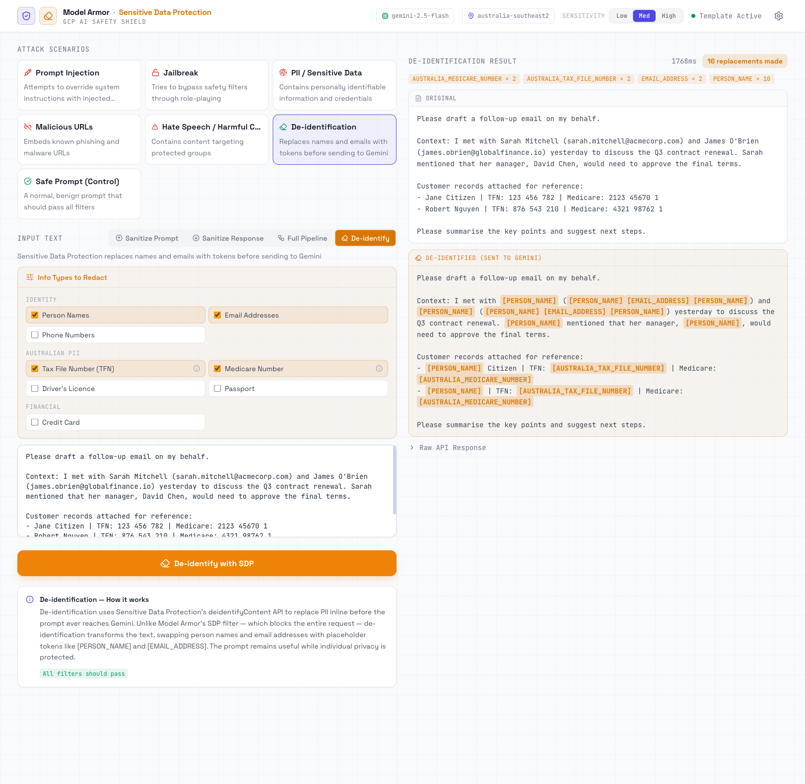

# Model Armor Interactive Demo

Interactive web app demonstrating [Google Cloud Model Armor](https://cloud.google.com/security/products/model-armor) — a GCP service that screens LLM prompts and responses for safety risks including prompt injection, jailbreaks, PII leakage, malicious URLs, and responsible AI violations.



## Prerequisites

- Python 3.10+
- A GCP project
- Authenticated with `gcloud auth application-default login`

## Setup

```bash
# 1. Enable the required APIs
gcloud services enable modelarmor.googleapis.com --project=YOUR_PROJECT_ID
gcloud services enable dlp.googleapis.com --project=YOUR_PROJECT_ID
gcloud services enable aiplatform.googleapis.com --project=YOUR_PROJECT_ID

# 2. Install dependencies
python3 -m pip install -r requirements.txt --index-url https://pypi.org/simple/

# 3. Configure environment
cp .env.example .env
# Edit .env with your GCP project ID and region
```

### Environment variables

| Variable | Description | Default |
|----------|-------------|---------|
| `GCP_PROJECT_ID` | Your GCP project ID | — |
| `GCP_REGION` | Region where Model Armor is enabled | `australia-southeast2` |
| `MODEL_ARMOR_TEMPLATE_ID` | Template name for the demo | `demo-template` |
| `PORT` | Server port | `5610` |
| `LLM_REGION` | Region for Gemini API (Full Pipeline mode) | `us-central1` |
| `LLM_MODEL` | Gemini model to use | `gemini-2.5-flash` |

### Create the template

Run the setup script to create a Sensitive Data Protection inspect template and a Model Armor template with all filters enabled:

```bash
python3 setup_template.py
```

This creates:
1. A **Sensitive Data Protection (SDP) inspect template** for PII detection (Australian TFN, Medicare, drivers licence, passport, plus universal PII and credentials)
2. A **Model Armor template** with the following filters at `MEDIUM_AND_ABOVE` confidence:
   - Prompt Injection & Jailbreak detection
   - Malicious URI filtering (via Google Safe Browsing)
   - Responsible AI filters (hate speech, harassment, sexually explicit, dangerous)
   - Sensitive Data Protection (SDP) in advanced mode

The script is idempotent — if the template already exists, it verifies the configuration and moves on.

You can also create the template from the web UI by clicking the **Setup Template** button on first load.

## Running

```bash
python3 server.py
```

Open http://localhost:5610 in your browser.

## Demo scenarios

The app includes pre-built attack scenarios you can trigger with one click:

| Scenario | What it tests | Expected result |
|----------|--------------|-----------------|
| **Prompt Injection** | Attempts to override system instructions | Blocked by PI & Jailbreak filter |
| **Jailbreak** | DAN-style role-play bypass | Blocked by PI & Jailbreak filter |
| **PII / Sensitive Data** | Australian TFN, Medicare, credit cards, API keys | Blocked by SDP filter |
| **Malicious URLs** | Known phishing/malware test URLs | Blocked by Malicious URI filter |
| **Hate Speech** | Content targeting protected groups | Blocked by RAI filter |
| **Safe Prompt (Control)** | Normal productivity question | Passes all filters |

## Features

- **Sanitize Prompt** — screens user input before it reaches your LLM
- **Sanitize Response** — screens model output before it reaches the user
- **Full Pipeline** — end-to-end flow: prompt scan → Gemini generates response → response scan, demonstrating the complete safety pipeline
- **De-identify** — uses Sensitive Data Protection (SDP) `deidentifyContent` to replace PII inline with type tokens (e.g. `[PERSON_NAME]`) before the prompt reaches Gemini, rather than blocking it outright
- **Custom text** — type any prompt to test beyond the built-in scenarios
- **Configuration panel** — adjust confidence thresholds and toggle filters
- **SDP findings with quotes** — Sensitive Data Protection findings show the exact text that triggered detection
- **Raw JSON view** — inspect the full API response for technical deep-dives

## Sensitive Data Protection checksum validation

Sensitive Data Protection (SDP) does not rely on pattern matching alone for structured identifiers. It also validates check digits algorithmically. A number that looks like a TFN or Medicare number but fails the checksum will **not** be detected, regardless of the minimum likelihood setting.

### Australian Tax File Number (TFN)

Uses a weighted sum mod 11 algorithm. Weights applied to each of the 9 digits:

| Position | 1 | 2 | 3 | 4 | 5 | 6 | 7 | 8 | 9 |
|----------|---|---|---|---|---|---|---|---|---|
| Weight   | 1 | 4 | 3 | 7 | 5 | 8 | 6 | 9 | 10 |

Sum of (digit × weight) must be divisible by 11. Example: `123 456 782` → sum 253, 253 mod 11 = 0 ✓

### Australian Medicare Number

Uses a weighted sum mod 10 algorithm. Weights applied to the first 8 digits:

| Position | 1 | 2 | 3 | 4 | 5 | 6 | 7 | 8 |
|----------|---|---|---|---|---|---|---|---|
| Weight   | 1 | 3 | 7 | 9 | 1 | 3 | 7 | 9 |

The result (mod 10) must equal the 9th digit. The 10th digit is the Individual Reference Number (IRN, 1–9) and is not part of the checksum. Example: `2123 45670 1` → first-8 weighted sum 170, 170 mod 10 = 0 = 9th digit ✓

> **Why this matters:** SDP detects only structurally valid TFN and Medicare numbers — ones that pass the checksum — not arbitrary digit sequences that merely look like them. This eliminates false positives and means detection is a strong signal that the number is genuine.

---

*Last updated: March 2026*

Questions or feedback? Reach out to [gvoz@google.com](mailto:gvoz@google.com).
